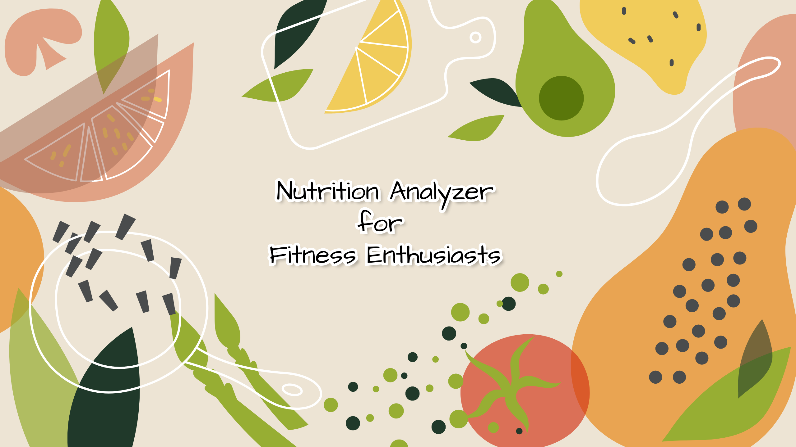
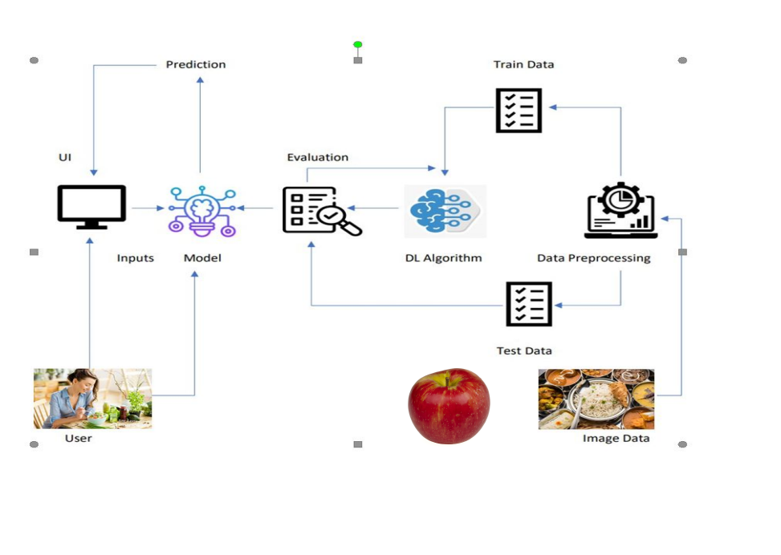

# Nutrition Analyzer For Fitness Enthusiast

Nutrition Analyzer is a user-friendly tool designed to help users find the nutritional value of various fruits. This project aims to promote healthier dietary choices by providing detailed nutritional information about fruits in an easy-to-access format.🍎🍌🥝

## Features

🌟 Search for Fruits: Get detailed nutritional information for a wide variety of fruits.

📊 Nutritional Breakdown: View calories, carbohydrates, proteins, fats, vitamins, and minerals.

🔍 Easy-to-Use Interface: Upload the image of the fruit.

🏋️‍♀️ Fitness-Friendly: Tailored for those tracking their fitness goals.

## Problem Statement
Food ,is essential for human life and has been the concern of many healthcare conventions. Nowadays new dietary assessment and nutrition analysis tools enable more opportunities to help people understand their daily eating habits, exploring nutrition patterns and maintain a healthy diet.

Nutritional analysis is the process of determining the nutritional content of food. It is a vital part of analytical chemistry that provides information about the chemical composition, processing, quality control and contamination of food.

## Objective
The main aim of the project is to building a model which is used for classifying the fruit depends on the different characteristics like colour, shape, texture etc. 
Here the user can capture the images of different fruits and then the image will be sent 
the trained model. 
The model analyses the image and detect the nutrition based on the fruits 
like (Sugar, Fibre, Protein, Calories, etc.)

## Architecture Diagram

## PROJECT FLOW
● The user interacts with the UI (User Interface) and give the image as input.
● Then the input image is then pass to our flask application,
● And finally with the help of the model which we build we will classify the
result and showcase it on the UI.
● To accomplish this, we have to complete all the activities and tasks listed
below
🗂️ Data Collection: Gather fruit images and nutritional data from reliable sources.
🧹 Data Preprocessing: Clean, resize, and augment images for model training.
🤖 Model Building: Train a machine learning model for fruit classification.
🖥️ Application Building: Develop a Flask-based web app to integrate the model and UI.

